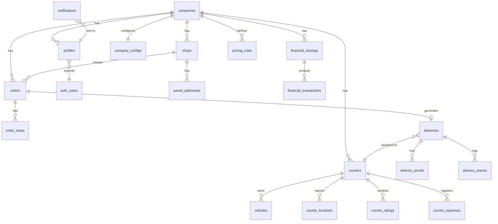

# Chega.la - Modelo de Dados

Modelo entidade-relacionamento do ecossistema Chega.la. Tabelas e campos em snake_case (ingles). Auth gerenciado pelo Supabase GoTrue (schema auth).

---

## Diagrama Entidade-Relacionamento



---

## Entidades Detalhadas

### companies

Empresa de entregas que contrata o Chega.la. Unidade de multi-tenancy.

| Campo | Tipo | Descricao |
|-------|------|-----------|
| id | uuid | PK |
| name | text | Nome da empresa |
| cnpj | text | CNPJ (unique) |
| phone | text | Telefone principal |
| email | text | Email de contato |
| address | text | Endereco completo |
| lat | numeric(10,7) | Latitude do endereco |
| lng | numeric(10,7) | Longitude do endereco |
| logo_url | text | URL do logo (Supabase Storage) |
| subdomain | text | Subdominio personalizado (unique) |
| status | text | active, suspended, cancelled |
| created_at | timestamptz | Data de criacao |
| updated_at | timestamptz | Data de atualizacao |

---

### company_configs

Configuracoes operacionais da empresa. 1:1 com companies.

| Campo | Tipo | Descricao |
|-------|------|-----------|
| id | uuid | PK |
| company_id | uuid | FK para companies (unique) |
| business_hours | jsonb | Horarios de funcionamento por dia da semana |
| coverage_type | text | radius, polygon |
| coverage_radius_km | numeric(6,2) | Raio de cobertura (se type=radius) |
| coverage_polygon | jsonb | Coordenadas do poligono (se type=polygon) |
| vehicle_types | text[] | Tipos aceitos: motorcycle, car, bicycle, van |
| rain_surcharge_pct | numeric(5,2) | Percentual de taxa de chuva |
| peak_surcharge_pct | numeric(5,2) | Percentual de taxa de pico |
| auto_messages | jsonb | Mensagens automaticas (welcome, confirmation, delivered) |
| features_enabled | jsonb | Features ativas/inativas |
| notification_channels | text[] | Canais de notificacao habilitados |
| created_at | timestamptz | Data de criacao |
| updated_at | timestamptz | Data de atualizacao |

---

### profiles

Perfil estendido do usuario, vinculado a auth.users do Supabase GoTrue.

| Campo | Tipo | Descricao |
|-------|------|-----------|
| id | uuid | PK (mesmo id de auth.users) |
| company_id | uuid | FK para companies |
| role | text | admin, operator, attendant, shop, courier |
| full_name | text | Nome completo |
| phone | text | Telefone |
| avatar_url | text | URL da foto (Supabase Storage) |
| active | boolean | Ativo no sistema |
| permissions | jsonb | Permissoes customizadas (para attendant) |
| last_login_at | timestamptz | Ultimo login |
| last_login_ip | text | IP do ultimo login |
| created_at | timestamptz | Data de criacao |
| updated_at | timestamptz | Data de atualizacao |

---

### shops

Lojistas — clientes da empresa de entregas que solicitam entregas.

| Campo | Tipo | Descricao |
|-------|------|-----------|
| id | uuid | PK |
| company_id | uuid | FK para companies |
| profile_id | uuid | FK para profiles |
| trade_name | text | Nome fantasia |
| document | text | CNPJ ou CPF |
| phone | text | Telefone |
| address | text | Endereco principal |
| lat | numeric(10,7) | Latitude |
| lng | numeric(10,7) | Longitude |
| default_pickup_address | text | Endereco de coleta padrao |
| default_pickup_lat | numeric(10,7) | Latitude de coleta padrao |
| default_pickup_lng | numeric(10,7) | Longitude de coleta padrao |
| billing_type | text | per_delivery, monthly |
| active | boolean | Ativo |
| created_at | timestamptz | Data de criacao |
| updated_at | timestamptz | Data de atualizacao |

---

### saved_addresses

Enderecos favoritos salvos por lojistas.

| Campo | Tipo | Descricao |
|-------|------|-----------|
| id | uuid | PK |
| shop_id | uuid | FK para shops |
| label | text | Nome do endereco (ex: "Fornecedor X") |
| address | text | Endereco completo |
| lat | numeric(10,7) | Latitude |
| lng | numeric(10,7) | Longitude |
| is_default | boolean | Endereco padrao |
| created_at | timestamptz | Data de criacao |

---

### couriers

Motoboys/entregadores vinculados a uma empresa.

| Campo | Tipo | Descricao |
|-------|------|-----------|
| id | uuid | PK |
| company_id | uuid | FK para companies |
| profile_id | uuid | FK para profiles |
| full_name | text | Nome completo |
| cpf | text | CPF (unique por company) |
| phone | text | Telefone |
| cnh | text | Numero da CNH |
| photo_url | text | URL da foto (Supabase Storage) |
| status | text | available, busy, offline |
| coverage_radius_km | numeric(6,2) | Raio de atuacao (override do config empresa) |
| rating_avg | numeric(3,2) | Media de avaliacao (1.00-5.00) |
| rating_count | integer | Total de avaliacoes |
| total_deliveries | integer | Total de entregas concluidas |
| active | boolean | Ativo |
| created_at | timestamptz | Data de criacao |
| updated_at | timestamptz | Data de atualizacao |

---

### vehicles

Veiculos dos motoboys. Um courier pode ter multiplos veiculos.

| Campo | Tipo | Descricao |
|-------|------|-----------|
| id | uuid | PK |
| courier_id | uuid | FK para couriers |
| type | text | motorcycle, car, bicycle, van |
| plate | text | Placa do veiculo |
| model | text | Modelo |
| color | text | Cor |
| is_primary | boolean | Veiculo principal |
| created_at | timestamptz | Data de criacao |

---

### orders

Pedidos de entrega. Unidade central do sistema.

| Campo | Tipo | Descricao |
|-------|------|-----------|
| id | uuid | PK |
| company_id | uuid | FK para companies |
| shop_id | uuid | FK para shops (nullable — pedido pode ser criado pela central) |
| order_number | integer | Numero sequencial por empresa |
| status | text | pending, accepted, assigned, picked_up, in_transit, delivered, cancelled, returned |
| sender_name | text | Nome do remetente |
| sender_phone | text | Telefone do remetente |
| pickup_address | text | Endereco de coleta |
| pickup_lat | numeric(10,7) | Latitude de coleta |
| pickup_lng | numeric(10,7) | Longitude de coleta |
| delivery_address | text | Endereco de entrega |
| delivery_lat | numeric(10,7) | Latitude de entrega |
| delivery_lng | numeric(10,7) | Longitude de entrega |
| recipient_name | text | Nome do destinatario |
| recipient_phone | text | Telefone do destinatario |
| cargo_type | text | document, food, fragile, heavy |
| declared_value | numeric(10,2) | Valor declarado do conteudo |
| notes | text | Observacoes e instrucoes especiais |
| estimated_distance_km | numeric(8,2) | Distancia estimada |
| estimated_duration_min | integer | Tempo estimado em minutos |
| estimated_price | numeric(10,2) | Valor estimado |
| final_price | numeric(10,2) | Valor final cobrado |
| payment_method | text | cash, pix, card, billed |
| payment_by | text | sender, recipient |
| scheduled_at | timestamptz | Data e hora agendada (nullable) |
| tracking_code | text | Codigo de rastreamento publico (unique) |
| created_by | uuid | FK para profiles (quem criou) |
| updated_by | uuid | FK para profiles (quem alterou por ultimo) |
| created_at | timestamptz | Data de criacao |
| updated_at | timestamptz | Data de atualizacao |

---

### order_stops

Paradas adicionais em pedidos com multiplos destinos.

| Campo | Tipo | Descricao |
|-------|------|-----------|
| id | uuid | PK |
| order_id | uuid | FK para orders |
| stop_order | integer | Ordem da parada (1, 2, 3...) |
| address | text | Endereco da parada |
| lat | numeric(10,7) | Latitude |
| lng | numeric(10,7) | Longitude |
| recipient_name | text | Nome do destinatario desta parada |
| recipient_phone | text | Telefone |
| notes | text | Instrucoes da parada |
| status | text | pending, arrived, completed, skipped |
| completed_at | timestamptz | Quando foi concluida |
| created_at | timestamptz | Data de criacao |

---

### deliveries

Execucao da entrega. Vincula pedido a motoboy.

| Campo | Tipo | Descricao |
|-------|------|-----------|
| id | uuid | PK |
| order_id | uuid | FK para orders (unique) |
| courier_id | uuid | FK para couriers |
| company_id | uuid | FK para companies |
| status | text | assigned, accepted, en_route_pickup, arrived_pickup, picked_up, en_route_delivery, arrived_delivery, delivered, failed |
| assigned_at | timestamptz | Momento da atribuicao |
| accepted_at | timestamptz | Momento da aceitacao |
| picked_up_at | timestamptz | Momento da coleta |
| delivered_at | timestamptz | Momento da entrega |
| actual_distance_km | numeric(8,2) | Distancia real percorrida |
| actual_duration_min | integer | Duracao real em minutos |
| courier_commission | numeric(10,2) | Comissao do motoboy |
| occurrence_type | text | none, absent, not_found, refused, other |
| occurrence_notes | text | Detalhes da ocorrencia |
| created_at | timestamptz | Data de criacao |
| updated_at | timestamptz | Data de atualizacao |

---

### delivery_proofs

Provas de entrega (fotos, assinaturas).

| Campo | Tipo | Descricao |
|-------|------|-----------|
| id | uuid | PK |
| delivery_id | uuid | FK para deliveries |
| type | text | photo, signature |
| file_url | text | URL do arquivo (Supabase Storage) |
| captured_at | timestamptz | Momento da captura |
| lat | numeric(10,7) | Latitude no momento da captura |
| lng | numeric(10,7) | Longitude no momento da captura |
| created_at | timestamptz | Data de criacao |

---

### delivery_events

Timeline de eventos de uma entrega (log imutavel).

| Campo | Tipo | Descricao |
|-------|------|-----------|
| id | uuid | PK |
| delivery_id | uuid | FK para deliveries |
| event_type | text | Tipo do evento (status_change, location_update, note, occurrence) |
| old_status | text | Status anterior (nullable) |
| new_status | text | Novo status (nullable) |
| description | text | Descricao do evento |
| actor_id | uuid | FK para profiles (quem causou o evento) |
| lat | numeric(10,7) | Latitude (nullable) |
| lng | numeric(10,7) | Longitude (nullable) |
| metadata | jsonb | Dados adicionais do evento |
| created_at | timestamptz | Timestamp do evento |

---

### courier_locations

Historico de localizacao dos motoboys. Tabela de alta escrita.

| Campo | Tipo | Descricao |
|-------|------|-----------|
| id | uuid | PK |
| courier_id | uuid | FK para couriers |
| company_id | uuid | FK para companies |
| delivery_id | uuid | FK para deliveries (nullable — rastreamento quando disponivel sem entrega) |
| lat | numeric(10,7) | Latitude |
| lng | numeric(10,7) | Longitude |
| accuracy | numeric(6,2) | Precisao GPS em metros |
| speed | numeric(6,2) | Velocidade em km/h |
| heading | numeric(5,2) | Direcao em graus (0-360) |
| recorded_at | timestamptz | Timestamp do dispositivo |
| created_at | timestamptz | Timestamp do servidor |

---

### courier_ratings

Avaliacoes de motoboys feitas por lojistas.

| Campo | Tipo | Descricao |
|-------|------|-----------|
| id | uuid | PK |
| courier_id | uuid | FK para couriers |
| shop_id | uuid | FK para shops |
| delivery_id | uuid | FK para deliveries (unique) |
| rating | integer | Nota 1 a 5 |
| comment | text | Comentario (nullable) |
| created_at | timestamptz | Data da avaliacao |

---

### courier_expenses

Despesas registradas por motoboys.

| Campo | Tipo | Descricao |
|-------|------|-----------|
| id | uuid | PK |
| courier_id | uuid | FK para couriers |
| company_id | uuid | FK para companies |
| type | text | fuel, maintenance, toll, other |
| amount | numeric(10,2) | Valor |
| description | text | Descricao |
| receipt_url | text | URL do comprovante (nullable) |
| expense_date | date | Data da despesa |
| created_at | timestamptz | Data de criacao |

---

### pricing_rules

Regras de precificacao da empresa.

| Campo | Tipo | Descricao |
|-------|------|-----------|
| id | uuid | PK |
| company_id | uuid | FK para companies |
| name | text | Nome da regra (ex: "Padrao", "Noturno") |
| type | text | distance, weight, fixed, zone |
| base_price | numeric(10,2) | Preco base |
| price_per_km | numeric(10,2) | Preco por km adicional |
| min_distance_km | numeric(6,2) | Distancia minima cobrada |
| extra_stop_price | numeric(10,2) | Preco por parada adicional |
| time_ranges | jsonb | Faixas horarias e multiplicadores |
| active | boolean | Regra ativa |
| priority | integer | Ordem de avaliacao (menor = primeiro) |
| created_at | timestamptz | Data de criacao |
| updated_at | timestamptz | Data de atualizacao |

---

### financial_closings

Fechamentos financeiros diarios.

| Campo | Tipo | Descricao |
|-------|------|-----------|
| id | uuid | PK |
| company_id | uuid | FK para companies |
| closing_date | date | Data do fechamento |
| total_orders | integer | Total de pedidos |
| total_revenue | numeric(12,2) | Receita total |
| total_commissions | numeric(12,2) | Total de comissoes |
| total_adjustments | numeric(12,2) | Total de ajustes |
| net_result | numeric(12,2) | Resultado liquido |
| status | text | open, closed, audited |
| closed_by | uuid | FK para profiles (quem fechou) |
| closed_at | timestamptz | Quando foi fechado |
| created_at | timestamptz | Data de criacao |
| updated_at | timestamptz | Data de atualizacao |

---

### financial_transactions

Transacoes individuais dentro de um fechamento.

| Campo | Tipo | Descricao |
|-------|------|-----------|
| id | uuid | PK |
| closing_id | uuid | FK para financial_closings |
| company_id | uuid | FK para companies |
| delivery_id | uuid | FK para deliveries (nullable — ajustes manuais) |
| courier_id | uuid | FK para couriers (nullable) |
| shop_id | uuid | FK para shops (nullable) |
| type | text | delivery_fee, commission, bonus, discount, penalty, adjustment |
| amount | numeric(10,2) | Valor (positivo = credito, negativo = debito) |
| payment_method | text | cash, pix, card, billed |
| description | text | Descricao |
| created_by | uuid | FK para profiles |
| created_at | timestamptz | Data de criacao |

---

### notifications

Notificacoes enviadas aos usuarios.

| Campo | Tipo | Descricao |
|-------|------|-----------|
| id | uuid | PK |
| profile_id | uuid | FK para profiles |
| company_id | uuid | FK para companies |
| channel | text | push, email, sms |
| title | text | Titulo da notificacao |
| body | text | Corpo da notificacao |
| type | text | order_status, delivery_assigned, alert, system |
| reference_type | text | order, delivery, financial (nullable) |
| reference_id | uuid | ID da entidade referenciada (nullable) |
| read | boolean | Se foi lida |
| sent_at | timestamptz | Quando foi enviada |
| read_at | timestamptz | Quando foi lida |
| created_at | timestamptz | Data de criacao |

---

## Enums

```sql
CREATE TYPE company_status AS ENUM ('active', 'suspended', 'cancelled');

CREATE TYPE user_role AS ENUM ('admin', 'operator', 'attendant', 'shop', 'courier');

CREATE TYPE courier_status AS ENUM ('available', 'busy', 'offline');

CREATE TYPE vehicle_type AS ENUM ('motorcycle', 'car', 'bicycle', 'van');

CREATE TYPE order_status AS ENUM (
  'pending', 'accepted', 'assigned', 'picked_up',
  'in_transit', 'delivered', 'cancelled', 'returned'
);

CREATE TYPE delivery_status AS ENUM (
  'assigned', 'accepted', 'en_route_pickup', 'arrived_pickup',
  'picked_up', 'en_route_delivery', 'arrived_delivery', 'delivered', 'failed'
);

CREATE TYPE cargo_type AS ENUM ('document', 'food', 'fragile', 'heavy');

CREATE TYPE payment_method AS ENUM ('cash', 'pix', 'card', 'billed');

CREATE TYPE proof_type AS ENUM ('photo', 'signature');

CREATE TYPE occurrence_type AS ENUM ('none', 'absent', 'not_found', 'refused', 'other');

CREATE TYPE billing_type AS ENUM ('per_delivery', 'monthly');

CREATE TYPE expense_type AS ENUM ('fuel', 'maintenance', 'toll', 'other');

CREATE TYPE transaction_type AS ENUM (
  'delivery_fee', 'commission', 'bonus', 'discount', 'penalty', 'adjustment'
);

CREATE TYPE closing_status AS ENUM ('open', 'closed', 'audited');

CREATE TYPE notification_channel AS ENUM ('push', 'email', 'sms');

CREATE TYPE pricing_rule_type AS ENUM ('distance', 'weight', 'fixed', 'zone');
```

---

## Indices Recomendados

```sql
-- Multi-tenancy: todas as queries filtram por company_id
CREATE INDEX idx_profiles_company ON profiles(company_id);
CREATE INDEX idx_shops_company ON shops(company_id);
CREATE INDEX idx_couriers_company ON couriers(company_id);
CREATE INDEX idx_orders_company ON orders(company_id);
CREATE INDEX idx_deliveries_company ON deliveries(company_id);

-- Busca de pedidos por status (consulta mais frequente)
CREATE INDEX idx_orders_company_status ON orders(company_id, status);

-- Busca de pedidos por lojista
CREATE INDEX idx_orders_shop ON orders(shop_id);

-- Busca de pedidos por numero sequencial
CREATE UNIQUE INDEX idx_orders_company_number ON orders(company_id, order_number);

-- Rastreamento publico
CREATE UNIQUE INDEX idx_orders_tracking_code ON orders(tracking_code);

-- Entrega por pedido (1:1)
CREATE UNIQUE INDEX idx_deliveries_order ON deliveries(order_id);

-- Entregas ativas por motoboy
CREATE INDEX idx_deliveries_courier_status ON deliveries(courier_id, status);

-- Localizacao: consulta mais recente por motoboy
CREATE INDEX idx_courier_locations_courier_time ON courier_locations(courier_id, recorded_at DESC);

-- Localizacao durante entrega
CREATE INDEX idx_courier_locations_delivery ON courier_locations(delivery_id) WHERE delivery_id IS NOT NULL;

-- Fechamento financeiro por data
CREATE UNIQUE INDEX idx_financial_closings_company_date ON financial_closings(company_id, closing_date);

-- Transacoes por fechamento
CREATE INDEX idx_financial_transactions_closing ON financial_transactions(closing_id);

-- Transacoes por motoboy
CREATE INDEX idx_financial_transactions_courier ON financial_transactions(courier_id) WHERE courier_id IS NOT NULL;

-- Notificacoes nao lidas
CREATE INDEX idx_notifications_profile_unread ON notifications(profile_id, read) WHERE read = false;

-- Avaliacoes por entrega (unique)
CREATE UNIQUE INDEX idx_courier_ratings_delivery ON courier_ratings(delivery_id);

-- Timeline de eventos
CREATE INDEX idx_delivery_events_delivery ON delivery_events(delivery_id, created_at);
```

---

## Relacionamentos Principais

1. **Company → Profiles**: 1:N — cada empresa tem multiplos usuarios (operators, attendants)
2. **Company → Shops**: 1:N — cada empresa atende multiplos lojistas
3. **Company → Couriers**: 1:N — cada empresa gerencia multiplos motoboys
4. **Company → Orders**: 1:N — pedidos pertencem a uma empresa
5. **Company → Company Config**: 1:1 — cada empresa tem uma configuracao
6. **Shop → Orders**: 1:N — lojista cria multiplos pedidos
7. **Order → Order Stops**: 1:N — pedido pode ter multiplas paradas
8. **Order → Delivery**: 1:0..1 — pedido gera no maximo uma entrega ativa
9. **Delivery → Courier**: N:1 — motoboy executa multiplas entregas
10. **Delivery → Delivery Proofs**: 1:N — entrega tem multiplas provas (foto, assinatura)
11. **Delivery → Delivery Events**: 1:N — entrega gera timeline de eventos
12. **Courier → Vehicles**: 1:N — motoboy pode ter multiplos veiculos
13. **Courier → Courier Locations**: 1:N — historico de posicoes GPS
14. **Courier → Courier Ratings**: 1:N — avaliacoes dos lojistas
15. **Financial Closing → Transactions**: 1:N — fechamento contem transacoes
16. **Profile → auth.users**: 1:1 — perfil estende usuario do Supabase GoTrue
