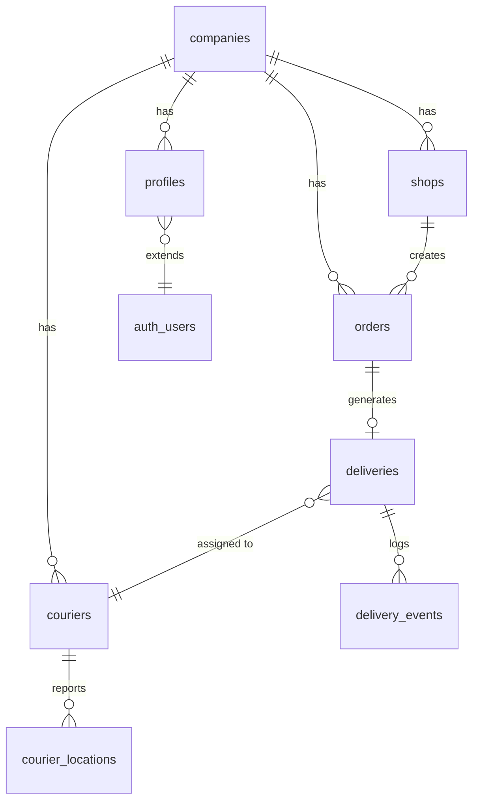

# Chega.la - Modelo de Dados Wave 1

Modelo entidade-relacionamento para a Wave 1 do Chega.la. Tabelas e campos em snake_case (ingles). Auth gerenciado pelo Supabase GoTrue (schema auth). Escopo limitado ao nucleo operacional: empresas, perfis, lojistas, motoboys, pedidos, entregas e rastreamento GPS.

---

## Diagrama Entidade-Relacionamento



---

## Entidades Detalhadas

### companies

Empresa de entregas que contrata o Chega.la. Unidade de multi-tenancy.

| Campo | Tipo | Descricao |
|-------|------|-----------|
| id | uuid | PK |
| name | text | Nome da empresa |
| cnpj | text | CNPJ (unique, nullable) |
| phone | text | Telefone principal |
| email | text | Email de contato |
| address | text | Endereco completo |
| lat | numeric(10,7) | Latitude do endereco |
| lng | numeric(10,7) | Longitude do endereco |
| logo_url | text | URL do logo (Supabase Storage) |
| status | text | active, suspended |
| created_at | timestamptz | Data de criacao |
| updated_at | timestamptz | Data de atualizacao |

---

### profiles

Perfil estendido do usuario, vinculado a auth.users do Supabase GoTrue.

| Campo | Tipo | Descricao |
|-------|------|-----------|
| id | uuid | PK (mesmo id de auth.users) |
| company_id | uuid | FK para companies |
| role | text | operator, shop, courier |
| full_name | text | Nome completo |
| phone | text | Telefone |
| avatar_url | text | URL da foto (Supabase Storage) |
| active | boolean | Ativo no sistema (default true) |
| created_at | timestamptz | Data de criacao |
| updated_at | timestamptz | Data de atualizacao |

---

### shops

Lojistas — clientes da empresa de entregas que solicitam entregas.

| Campo | Tipo | Descricao |
|-------|------|-----------|
| id | uuid | PK |
| company_id | uuid | FK para companies |
| profile_id | uuid | FK para profiles |
| trade_name | text | Nome fantasia |
| phone | text | Telefone |
| address | text | Endereco principal |
| lat | numeric(10,7) | Latitude |
| lng | numeric(10,7) | Longitude |
| active | boolean | Ativo (default true) |
| created_at | timestamptz | Data de criacao |
| updated_at | timestamptz | Data de atualizacao |

---

### couriers

Motoboys/entregadores vinculados a uma empresa.

| Campo | Tipo | Descricao |
|-------|------|-----------|
| id | uuid | PK |
| company_id | uuid | FK para companies |
| profile_id | uuid | FK para profiles |
| full_name | text | Nome completo |
| phone | text | Telefone |
| photo_url | text | URL da foto (Supabase Storage) |
| status | text | available, busy, offline (default offline) |
| total_deliveries | integer | Total de entregas concluidas (default 0) |
| active | boolean | Ativo (default true) |
| created_at | timestamptz | Data de criacao |
| updated_at | timestamptz | Data de atualizacao |

---

### orders

Pedidos de entrega. Unidade central do sistema.

| Campo | Tipo | Descricao |
|-------|------|-----------|
| id | uuid | PK |
| company_id | uuid | FK para companies |
| shop_id | uuid | FK para shops (nullable — pedido criado pela central) |
| order_number | integer | Numero sequencial por empresa |
| status | text | pending, assigned, picked_up, in_transit, delivered, cancelled |
| pickup_address | text | Endereco de coleta |
| pickup_lat | numeric(10,7) | Latitude de coleta |
| pickup_lng | numeric(10,7) | Longitude de coleta |
| delivery_address | text | Endereco de entrega |
| delivery_lat | numeric(10,7) | Latitude de entrega |
| delivery_lng | numeric(10,7) | Longitude de entrega |
| recipient_name | text | Nome do destinatario |
| recipient_phone | text | Telefone do destinatario |
| notes | text | Observacoes (nullable) |
| created_by | uuid | FK para profiles (quem criou) |
| created_at | timestamptz | Data de criacao |
| updated_at | timestamptz | Data de atualizacao |

---

### deliveries

Execucao da entrega. Vincula pedido a motoboy.

| Campo | Tipo | Descricao |
|-------|------|-----------|
| id | uuid | PK |
| order_id | uuid | FK para orders (unique) |
| courier_id | uuid | FK para couriers |
| company_id | uuid | FK para companies |
| status | text | assigned, accepted, picked_up, in_transit, delivered, failed |
| assigned_at | timestamptz | Momento da atribuicao |
| accepted_at | timestamptz | Momento da aceitacao (nullable) |
| picked_up_at | timestamptz | Momento da coleta (nullable) |
| delivered_at | timestamptz | Momento da entrega (nullable) |
| actual_distance_km | numeric(8,2) | Distancia real percorrida (nullable) |
| actual_duration_min | integer | Duracao real em minutos (nullable) |
| created_at | timestamptz | Data de criacao |
| updated_at | timestamptz | Data de atualizacao |

---

### delivery_events

Timeline de eventos de uma entrega (log imutavel).

| Campo | Tipo | Descricao |
|-------|------|-----------|
| id | uuid | PK |
| delivery_id | uuid | FK para deliveries |
| event_type | text | status_change, location_update, note |
| old_status | text | Status anterior (nullable) |
| new_status | text | Novo status (nullable) |
| description | text | Descricao do evento |
| actor_id | uuid | FK para profiles (quem causou o evento) |
| lat | numeric(10,7) | Latitude (nullable) |
| lng | numeric(10,7) | Longitude (nullable) |
| created_at | timestamptz | Timestamp do evento |

---

### courier_locations

Historico de localizacao dos motoboys. Tabela de alta escrita.

| Campo | Tipo | Descricao |
|-------|------|-----------|
| id | uuid | PK |
| courier_id | uuid | FK para couriers |
| company_id | uuid | FK para companies |
| delivery_id | uuid | FK para deliveries (nullable) |
| lat | numeric(10,7) | Latitude |
| lng | numeric(10,7) | Longitude |
| accuracy | numeric(6,2) | Precisao GPS em metros |
| recorded_at | timestamptz | Timestamp do dispositivo |
| created_at | timestamptz | Timestamp do servidor |

---

## Enums

```sql
CREATE TYPE company_status AS ENUM ('active', 'suspended');

CREATE TYPE user_role AS ENUM ('operator', 'shop', 'courier');

CREATE TYPE courier_status AS ENUM ('available', 'busy', 'offline');

CREATE TYPE order_status AS ENUM (
  'pending', 'assigned', 'picked_up',
  'in_transit', 'delivered', 'cancelled'
);

CREATE TYPE delivery_status AS ENUM (
  'assigned', 'accepted', 'picked_up',
  'in_transit', 'delivered', 'failed'
);

CREATE TYPE delivery_event_type AS ENUM (
  'status_change', 'location_update', 'note'
);
```

---

## Indices Recomendados

```sql
-- Multi-tenancy: todas as queries filtram por company_id
CREATE INDEX idx_profiles_company ON profiles(company_id);
CREATE INDEX idx_shops_company ON shops(company_id);
CREATE INDEX idx_couriers_company ON couriers(company_id);
CREATE INDEX idx_orders_company ON orders(company_id);
CREATE INDEX idx_deliveries_company ON deliveries(company_id);

-- Busca de pedidos por status (consulta mais frequente)
CREATE INDEX idx_orders_company_status ON orders(company_id, status);

-- Busca de pedidos por lojista
CREATE INDEX idx_orders_shop ON orders(shop_id);

-- Pedido por numero sequencial
CREATE UNIQUE INDEX idx_orders_company_number ON orders(company_id, order_number);

-- Entrega por pedido (1:1)
CREATE UNIQUE INDEX idx_deliveries_order ON deliveries(order_id);

-- Entregas ativas por motoboy
CREATE INDEX idx_deliveries_courier_status ON deliveries(courier_id, status);

-- Localizacao: consulta mais recente por motoboy
CREATE INDEX idx_courier_locations_courier_time ON courier_locations(courier_id, recorded_at DESC);

-- Localizacao durante entrega
CREATE INDEX idx_courier_locations_delivery ON courier_locations(delivery_id) WHERE delivery_id IS NOT NULL;

-- Timeline de eventos
CREATE INDEX idx_delivery_events_delivery ON delivery_events(delivery_id, created_at);
```

---

## Triggers

```sql
-- Atualizar updated_at automaticamente
CREATE OR REPLACE FUNCTION update_updated_at()
RETURNS TRIGGER AS $$
BEGIN
  NEW.updated_at = NOW();
  RETURN NEW;
END;
$$ LANGUAGE plpgsql;

-- Aplicar em todas as tabelas com updated_at
CREATE TRIGGER trg_companies_updated_at BEFORE UPDATE ON companies FOR EACH ROW EXECUTE FUNCTION update_updated_at();
CREATE TRIGGER trg_profiles_updated_at BEFORE UPDATE ON profiles FOR EACH ROW EXECUTE FUNCTION update_updated_at();
CREATE TRIGGER trg_shops_updated_at BEFORE UPDATE ON shops FOR EACH ROW EXECUTE FUNCTION update_updated_at();
CREATE TRIGGER trg_couriers_updated_at BEFORE UPDATE ON couriers FOR EACH ROW EXECUTE FUNCTION update_updated_at();
CREATE TRIGGER trg_orders_updated_at BEFORE UPDATE ON orders FOR EACH ROW EXECUTE FUNCTION update_updated_at();
CREATE TRIGGER trg_deliveries_updated_at BEFORE UPDATE ON deliveries FOR EACH ROW EXECUTE FUNCTION update_updated_at();

-- Gerar order_number sequencial por empresa
CREATE OR REPLACE FUNCTION generate_order_number()
RETURNS TRIGGER AS $$
BEGIN
  NEW.order_number = (
    SELECT COALESCE(MAX(order_number), 0) + 1
    FROM orders
    WHERE company_id = NEW.company_id
  );
  RETURN NEW;
END;
$$ LANGUAGE plpgsql;

CREATE TRIGGER trg_orders_number BEFORE INSERT ON orders FOR EACH ROW EXECUTE FUNCTION generate_order_number();
```

---

## Relacionamentos Principais

1. **Company → Profiles**: 1:N — cada empresa tem multiplos usuarios (operators)
2. **Company → Shops**: 1:N — cada empresa atende multiplos lojistas
3. **Company → Couriers**: 1:N — cada empresa gerencia multiplos motoboys
4. **Company → Orders**: 1:N — pedidos pertencem a uma empresa
5. **Shop → Orders**: 1:N — lojista cria multiplos pedidos
6. **Order → Delivery**: 1:0..1 — pedido gera no maximo uma entrega ativa
7. **Delivery → Courier**: N:1 — motoboy executa multiplas entregas
8. **Delivery → Delivery Events**: 1:N — entrega gera timeline de eventos
9. **Courier → Courier Locations**: 1:N — historico de posicoes GPS
10. **Profile → auth.users**: 1:1 — perfil estende usuario do Supabase GoTrue

---

## Nota sobre Escopo

Tabelas **fora do escopo** da Wave 1 (serao adicionadas em waves futuras):
- `company_configs` — configuracoes avancadas da empresa
- `saved_addresses` — enderecos favoritos do lojista
- `vehicles` — veiculos dos motoboys
- `order_stops` — multiplas paradas
- `delivery_proofs` — fotos e assinaturas
- `courier_ratings` — avaliacoes
- `courier_expenses` — despesas
- `pricing_rules` — precificacao
- `financial_closings` — fechamento financeiro
- `financial_transactions` — transacoes financeiras
- `notifications` — notificacoes persistidas
