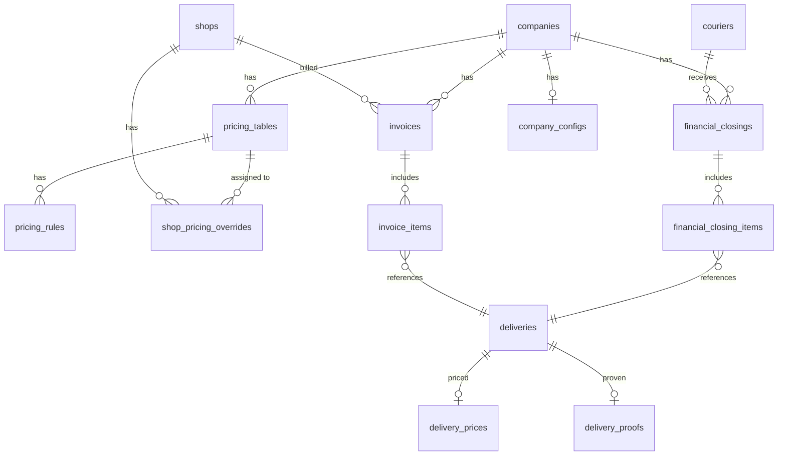

# Chega.la - Modelo de Dados Wave 2

Extensao do modelo entidade-relacionamento para a Wave 2 do Chega.la. Novas tabelas para precificacao, fechamento financeiro, faturamento, Proof of Delivery e configuracoes de empresa. Incremental sobre Wave 1 — tabelas existentes nao sao redefinidas aqui.

---

## Diagrama Entidade-Relacionamento (Wave 2 — novas entidades)



---

## Entidades Detalhadas

### company_configs

Configuracoes da empresa. Uma linha por empresa. Extensivel para futuras configs.

| Campo | Tipo | Descricao |
|-------|------|-----------|
| id | uuid | PK |
| company_id | uuid | FK para companies (unique) |
| pod_required | boolean | POD obrigatorio para marcar entregue (default false) |
| default_closing_period | text | Periodo padrao de fechamento: daily, weekly, monthly (default weekly) |
| default_invoice_period | text | Periodo padrao de faturamento: daily, weekly, monthly (default monthly) |
| created_at | timestamptz | Data de criacao |
| updated_at | timestamptz | Data de atualizacao |

---

### pricing_tables

Tabelas de preco da empresa. Cada empresa pode ter varias, apenas uma ativa por vez.

| Campo | Tipo | Descricao |
|-------|------|-----------|
| id | uuid | PK |
| company_id | uuid | FK para companies |
| name | text | Nome descritivo (ex: "Tabela padrao", "Tabela chuva") |
| active | boolean | Se e a tabela ativa da empresa (default false) |
| created_at | timestamptz | Data de criacao |
| updated_at | timestamptz | Data de atualizacao |

---

### pricing_rules

Regras de precificacao dentro de uma tabela. Cada tabela pode ter multiplas regras.

| Campo | Tipo | Descricao |
|-------|------|-----------|
| id | uuid | PK |
| pricing_table_id | uuid | FK para pricing_tables |
| rule_type | text | per_km, distance_range, neighborhood, flat_rate, surcharge |
| base_value | numeric(10,2) | Valor base em reais (para per_km: valor base; para flat_rate: valor fixo) |
| per_km_value | numeric(10,2) | Valor por km adicional (nullable, usado em per_km) |
| min_distance_km | numeric(8,2) | Distancia minima da faixa em km (nullable, usado em distance_range) |
| max_distance_km | numeric(8,2) | Distancia maxima da faixa em km (nullable, usado em distance_range) |
| neighborhood | text | Nome do bairro (nullable, usado em neighborhood) |
| surcharge_type | text | rain, night, weekend (nullable, usado em surcharge) |
| surcharge_mode | text | percentage, fixed (nullable, usado em surcharge) |
| surcharge_value | numeric(10,2) | Valor ou percentual do surcharge (nullable) |
| priority | integer | Ordem de avaliacao das regras (menor = primeiro, default 0) |
| created_at | timestamptz | Data de criacao |

---

### shop_pricing_overrides

Override de tabela de preco por lojista. Se existir, usa esta tabela em vez da tabela ativa da empresa.

| Campo | Tipo | Descricao |
|-------|------|-----------|
| id | uuid | PK |
| shop_id | uuid | FK para shops (unique) |
| pricing_table_id | uuid | FK para pricing_tables |
| company_id | uuid | FK para companies |
| created_at | timestamptz | Data de criacao |

---

### delivery_prices

Valor calculado de cada entrega. Uma linha por delivery.

| Campo | Tipo | Descricao |
|-------|------|-----------|
| id | uuid | PK |
| delivery_id | uuid | FK para deliveries (unique) |
| company_id | uuid | FK para companies |
| pricing_table_id | uuid | FK para pricing_tables (tabela usada no calculo) |
| pricing_rule_id | uuid | FK para pricing_rules (regra principal aplicada) |
| estimated_distance_km | numeric(8,2) | Distancia estimada (coleta → entrega) |
| actual_distance_km | numeric(8,2) | Distancia real via GPS (nullable, preenchido ao concluir) |
| base_price | numeric(10,2) | Preco base calculado |
| surcharge_amount | numeric(10,2) | Valor total de surcharges (default 0) |
| total_price | numeric(10,2) | Preco final (base + surcharges) |
| calculated_at | timestamptz | Momento do calculo |
| recalculated_at | timestamptz | Momento do recalculo (nullable, se houve ajuste por GPS) |

---

### financial_closings

Fechamento financeiro por motoboy. Agrega entregas de um periodo.

| Campo | Tipo | Descricao |
|-------|------|-----------|
| id | uuid | PK |
| company_id | uuid | FK para companies |
| courier_id | uuid | FK para couriers |
| period_start | date | Inicio do periodo |
| period_end | date | Fim do periodo |
| total_deliveries | integer | Quantidade de entregas no periodo |
| total_distance_km | numeric(10,2) | Distancia total percorrida |
| total_amount | numeric(10,2) | Valor total a pagar ao motoboy |
| status | text | draft, confirmed, paid |
| confirmed_at | timestamptz | Momento da confirmacao (nullable) |
| paid_at | timestamptz | Momento do pagamento (nullable) |
| created_at | timestamptz | Data de criacao |
| updated_at | timestamptz | Data de atualizacao |

---

### financial_closing_items

Entregas incluidas em um fechamento. Vincula fechamento a deliveries.

| Campo | Tipo | Descricao |
|-------|------|-----------|
| id | uuid | PK |
| closing_id | uuid | FK para financial_closings |
| delivery_id | uuid | FK para deliveries |
| delivery_price | numeric(10,2) | Valor da entrega (snapshot no momento do fechamento) |
| distance_km | numeric(8,2) | Distancia da entrega (snapshot) |
| delivered_at | timestamptz | Momento da entrega (snapshot) |

---

### invoices

Faturas para lojistas. Agrega entregas de um periodo.

| Campo | Tipo | Descricao |
|-------|------|-----------|
| id | uuid | PK |
| company_id | uuid | FK para companies |
| shop_id | uuid | FK para shops |
| invoice_number | integer | Numero sequencial por empresa |
| period_start | date | Inicio do periodo |
| period_end | date | Fim do periodo |
| total_deliveries | integer | Quantidade de entregas |
| total_distance_km | numeric(10,2) | Distancia total |
| total_amount | numeric(10,2) | Valor total da fatura |
| status | text | draft, sent, paid |
| sent_at | timestamptz | Momento do envio ao lojista (nullable) |
| paid_at | timestamptz | Momento do pagamento (nullable) |
| created_at | timestamptz | Data de criacao |
| updated_at | timestamptz | Data de atualizacao |

---

### invoice_items

Entregas incluidas em uma fatura.

| Campo | Tipo | Descricao |
|-------|------|-----------|
| id | uuid | PK |
| invoice_id | uuid | FK para invoices |
| delivery_id | uuid | FK para deliveries |
| order_number | integer | Numero do pedido (snapshot) |
| pickup_address | text | Endereco de coleta (snapshot) |
| delivery_address | text | Endereco de entrega (snapshot) |
| distance_km | numeric(8,2) | Distancia (snapshot) |
| price | numeric(10,2) | Valor cobrado (snapshot) |
| delivered_at | timestamptz | Momento da entrega (snapshot) |

---

### delivery_proofs

Comprovante de entrega (Proof of Delivery). Uma linha por delivery.

| Campo | Tipo | Descricao |
|-------|------|-----------|
| id | uuid | PK |
| delivery_id | uuid | FK para deliveries (unique) |
| company_id | uuid | FK para companies |
| courier_id | uuid | FK para couriers |
| photo_url | text | URL da foto no Supabase Storage |
| signature_url | text | URL da assinatura no Supabase Storage |
| lat | numeric(10,7) | Latitude no momento da captura |
| lng | numeric(10,7) | Longitude no momento da captura |
| captured_at | timestamptz | Timestamp do dispositivo no momento da captura |
| created_at | timestamptz | Timestamp do servidor |

---

## Enums (Wave 2)

```sql
CREATE TYPE pricing_rule_type AS ENUM (
  'per_km', 'distance_range', 'neighborhood',
  'flat_rate', 'surcharge'
);

CREATE TYPE surcharge_type AS ENUM ('rain', 'night', 'weekend');

CREATE TYPE surcharge_mode AS ENUM ('percentage', 'fixed');

CREATE TYPE closing_status AS ENUM ('draft', 'confirmed', 'paid');

CREATE TYPE invoice_status AS ENUM ('draft', 'sent', 'paid');

CREATE TYPE closing_period AS ENUM ('daily', 'weekly', 'monthly');
```

---

## Indices Recomendados (Wave 2)

```sql
-- Tabelas de preco por empresa
CREATE INDEX idx_pricing_tables_company ON pricing_tables(company_id);
CREATE UNIQUE INDEX idx_pricing_tables_company_active ON pricing_tables(company_id) WHERE active = true;

-- Regras por tabela
CREATE INDEX idx_pricing_rules_table ON pricing_rules(pricing_table_id, priority);

-- Override por lojista (unico)
CREATE UNIQUE INDEX idx_shop_pricing_shop ON shop_pricing_overrides(shop_id);

-- Preco por entrega (unico)
CREATE UNIQUE INDEX idx_delivery_prices_delivery ON delivery_prices(delivery_id);

-- Fechamentos por empresa e motoboy
CREATE INDEX idx_closings_company ON financial_closings(company_id, status);
CREATE INDEX idx_closings_courier ON financial_closings(courier_id, period_start DESC);

-- Items do fechamento
CREATE INDEX idx_closing_items_closing ON financial_closing_items(closing_id);
CREATE UNIQUE INDEX idx_closing_items_delivery ON financial_closing_items(delivery_id);

-- Faturas por empresa e lojista
CREATE INDEX idx_invoices_company ON invoices(company_id, status);
CREATE INDEX idx_invoices_shop ON invoices(shop_id, period_start DESC);
CREATE UNIQUE INDEX idx_invoices_company_number ON invoices(company_id, invoice_number);

-- Items da fatura
CREATE INDEX idx_invoice_items_invoice ON invoice_items(invoice_id);
CREATE UNIQUE INDEX idx_invoice_items_delivery ON invoice_items(delivery_id);

-- Comprovante por entrega (unico)
CREATE UNIQUE INDEX idx_delivery_proofs_delivery ON delivery_proofs(delivery_id);

-- Config por empresa (unica)
CREATE UNIQUE INDEX idx_company_configs_company ON company_configs(company_id);
```

---

## Triggers (Wave 2)

```sql
-- Atualizar updated_at nas novas tabelas
CREATE TRIGGER trg_company_configs_updated_at BEFORE UPDATE ON company_configs FOR EACH ROW EXECUTE FUNCTION update_updated_at();
CREATE TRIGGER trg_pricing_tables_updated_at BEFORE UPDATE ON pricing_tables FOR EACH ROW EXECUTE FUNCTION update_updated_at();
CREATE TRIGGER trg_closings_updated_at BEFORE UPDATE ON financial_closings FOR EACH ROW EXECUTE FUNCTION update_updated_at();
CREATE TRIGGER trg_invoices_updated_at BEFORE UPDATE ON invoices FOR EACH ROW EXECUTE FUNCTION update_updated_at();

-- Gerar invoice_number sequencial por empresa
CREATE OR REPLACE FUNCTION generate_invoice_number()
RETURNS TRIGGER AS $$
BEGIN
  NEW.invoice_number = (
    SELECT COALESCE(MAX(invoice_number), 0) + 1
    FROM invoices
    WHERE company_id = NEW.company_id
  );
  RETURN NEW;
END;
$$ LANGUAGE plpgsql;

CREATE TRIGGER trg_invoices_number BEFORE INSERT ON invoices FOR EACH ROW EXECUTE FUNCTION generate_invoice_number();

-- Garantir apenas uma pricing_table ativa por empresa
CREATE OR REPLACE FUNCTION enforce_single_active_pricing_table()
RETURNS TRIGGER AS $$
BEGIN
  IF NEW.active = true THEN
    UPDATE pricing_tables
    SET active = false
    WHERE company_id = NEW.company_id AND id != NEW.id AND active = true;
  END IF;
  RETURN NEW;
END;
$$ LANGUAGE plpgsql;

CREATE TRIGGER trg_pricing_tables_single_active BEFORE INSERT OR UPDATE ON pricing_tables FOR EACH ROW EXECUTE FUNCTION enforce_single_active_pricing_table();
```

---

## Relacionamentos Principais (Wave 2 — novos)

1. **Company → Company Configs**: 1:0..1 — cada empresa tem no maximo uma config
2. **Company → Pricing Tables**: 1:N — empresa cria multiplas tabelas de preco
3. **Pricing Table → Pricing Rules**: 1:N — cada tabela tem multiplas regras
4. **Shop → Shop Pricing Override**: 1:0..1 — lojista pode ter override de tabela
5. **Delivery → Delivery Price**: 1:0..1 — cada entrega tem no maximo um preco calculado
6. **Delivery → Delivery Proof**: 1:0..1 — cada entrega tem no maximo um comprovante
7. **Company → Financial Closings**: 1:N — empresa gera multiplos fechamentos
8. **Courier → Financial Closings**: 1:N — motoboy recebe multiplos fechamentos
9. **Financial Closing → Financial Closing Items**: 1:N — fechamento inclui multiplas entregas
10. **Company → Invoices**: 1:N — empresa gera multiplas faturas
11. **Shop → Invoices**: 1:N — lojista recebe multiplas faturas
12. **Invoice → Invoice Items**: 1:N — fatura inclui multiplas entregas
13. **Delivery → Financial Closing Item**: 1:0..1 — entrega pertence a no maximo um fechamento
14. **Delivery → Invoice Item**: 1:0..1 — entrega pertence a no maximo uma fatura

---

## Nota sobre Escopo

Tabelas **fora do escopo** da Wave 2 (serao adicionadas em waves futuras):
- `dispatch_suggestions` — sugestoes de despacho inteligente
- `delivery_etas` — estimativas de tempo de entrega
- `tracking_links` — links publicos de rastreamento para cliente final
- `courier_compliance` — conformidade regulatoria (periculosidade)
- `analytics_snapshots` — snapshots de metricas pre-calculadas
