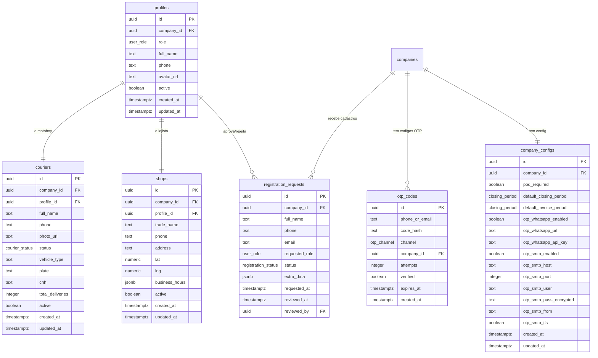

# Chega.la - Modelo de Dados Wave 4: Seguranca, Login, Perfil

Entidades novas e modificadas para RBAC, login OTP, perfil editavel, avatar, gestao de usuarios e self-registration.

---

## Diagrama Entidade-Relacionamento (Wave 4 — novas/modificadas)



---

## Entidades Novas

### otp_codes

Armazena codigos OTP gerados para login. Cada codigo expira em 5 minutos.

| Campo | Tipo | Descricao |
|-------|------|-----------|
| id | uuid | PK, gen_random_uuid() |
| phone_or_email | text | Telefone ou email do destinatario |
| code_hash | text | Hash bcrypt do codigo de 6 digitos |
| channel | otp_channel | Canal de envio: 'whatsapp' ou 'email' |
| company_id | uuid | FK para companies (nullable — OTP pode ser pre-login) |
| attempts | integer | Tentativas de verificacao (max 5). Default 0 |
| verified | boolean | Se o codigo ja foi usado. Default false |
| expires_at | timestamptz | Momento de expiracao (created_at + 5 min) |
| created_at | timestamptz | Default now() |

### registration_requests

Solicitacoes de auto-cadastro pendentes de aprovacao do operador.

| Campo | Tipo | Descricao |
|-------|------|-----------|
| id | uuid | PK, gen_random_uuid() |
| company_id | uuid | FK para companies. Empresa alvo do cadastro |
| full_name | text | Nome completo do solicitante |
| phone | text | Telefone do solicitante |
| email | text | Email do solicitante (nullable) |
| requested_role | user_role | Papel solicitado: 'courier' ou 'shop' |
| status | registration_status | 'pending', 'approved', 'rejected' |
| extra_data | jsonb | Dados adicionais (veiculo, placa, nome da loja, etc.) |
| requested_at | timestamptz | Default now() |
| reviewed_at | timestamptz | Quando foi aprovado/rejeitado (nullable) |
| reviewed_by | uuid | FK para profiles. Operador que revisou (nullable) |

---

## Entidades Modificadas

### company_configs — Novos campos OTP

| Campo | Tipo | Descricao |
|-------|------|-----------|
| otp_whatsapp_enabled | boolean | Toggle WhatsApp OTP. Default false |
| otp_whatsapp_url | text | URL da instancia Evolution API (nullable) |
| otp_whatsapp_api_key | text | API Key da instancia Evolution (nullable) |
| otp_smtp_enabled | boolean | Toggle Email OTP. Default false |
| otp_smtp_host | text | Host do servidor SMTP (nullable) |
| otp_smtp_port | integer | Porta SMTP (nullable, sugestao: 587) |
| otp_smtp_user | text | Usuario SMTP (nullable) |
| otp_smtp_pass_encrypted | text | Senha SMTP criptografada (nullable) |
| otp_smtp_from | text | Email remetente (nullable) |
| otp_smtp_tls | boolean | TLS habilitado. Default true |

### couriers — Novos campos de veiculo

| Campo | Tipo | Descricao |
|-------|------|-----------|
| vehicle_type | text | Tipo de veiculo: 'moto', 'bicicleta', 'carro' (nullable) |
| plate | text | Placa do veiculo (nullable) |
| cnh | text | Numero da CNH (nullable) |

### shops — Novo campo de horario

| Campo | Tipo | Descricao |
|-------|------|-----------|
| business_hours | jsonb | Horario de funcionamento por dia da semana (nullable) |

### user_role enum — Novo valor

```sql
ALTER TYPE "public"."user_role" ADD VALUE 'super_admin';
```

---

## Enums Novos

```sql
CREATE TYPE "public"."otp_channel" AS ENUM('whatsapp', 'email');

CREATE TYPE "public"."registration_status" AS ENUM('pending', 'approved', 'rejected');
```

---

## Indices Recomendados

```sql
-- OTP: busca por telefone/email + nao expirado + nao verificado
CREATE INDEX "idx_otp_codes_lookup"
  ON "otp_codes"("phone_or_email", "expires_at" DESC)
  WHERE "verified" = false;

-- OTP: limpeza de codigos expirados
CREATE INDEX "idx_otp_codes_expires"
  ON "otp_codes"("expires_at")
  WHERE "verified" = false;

-- Registration requests: pendentes por empresa
CREATE INDEX "idx_registration_requests_company_status"
  ON "registration_requests"("company_id", "status")
  WHERE "status" = 'pending';

-- Registration requests: busca por telefone (evitar duplicatas)
CREATE INDEX "idx_registration_requests_phone"
  ON "registration_requests"("phone", "company_id");
```

---

## Triggers

```sql
-- Atualizar updated_at nas tabelas modificadas (reutiliza funcao existente)
-- company_configs ja tem trigger (wave 2)

-- Nao necessario trigger para otp_codes (imutavel apos criacao, exceto attempts/verified)
-- Nao necessario trigger para registration_requests (reviewed_at setado manualmente)
```

---

## Relacionamentos Principais (Wave 4)

1. **companies → otp_codes**: 1:N — empresa tem multiplos codigos OTP ao longo do tempo
2. **companies → company_configs**: 1:1 — config agora inclui campos OTP (existente, extendido)
3. **companies → registration_requests**: 1:N — empresa recebe solicitacoes de cadastro
4. **profiles → registration_requests**: 1:N via reviewed_by — operador aprova/rejeita cadastros
5. **profiles → couriers**: 1:1 via profile_id — motoboy agora com vehicle_type, plate, cnh
6. **profiles → shops**: 1:1 via profile_id — lojista agora com business_hours

---

## Schema Drizzle — Novas Tabelas

```typescript
// apps/backbone/db/schema/otp-codes.ts
import { pgTable, uuid, text, integer, boolean, timestamp } from "drizzle-orm/pg-core";
import { otpChannelEnum } from "./_enums";
import { companies } from "./companies";

export const otpCodes = pgTable("otp_codes", {
  id: uuid("id").primaryKey().defaultRandom(),
  phone_or_email: text("phone_or_email").notNull(),
  code_hash: text("code_hash").notNull(),
  channel: otpChannelEnum("channel").notNull(),
  company_id: uuid("company_id").references(() => companies.id, { onDelete: "restrict" }),
  attempts: integer("attempts").notNull().default(0),
  verified: boolean("verified").notNull().default(false),
  expires_at: timestamp("expires_at", { withTimezone: true, mode: "string" }).notNull(),
  created_at: timestamp("created_at", { withTimezone: true, mode: "string" }).notNull().defaultNow(),
});
```

```typescript
// apps/backbone/db/schema/registration-requests.ts
import { pgTable, uuid, text, jsonb, timestamp } from "drizzle-orm/pg-core";
import { userRoleEnum, registrationStatusEnum } from "./_enums";
import { companies } from "./companies";
import { profiles } from "./profiles";

export const registrationRequests = pgTable("registration_requests", {
  id: uuid("id").primaryKey().defaultRandom(),
  company_id: uuid("company_id").notNull().references(() => companies.id, { onDelete: "restrict" }),
  full_name: text("full_name").notNull(),
  phone: text("phone").notNull(),
  email: text("email"),
  requested_role: userRoleEnum("requested_role").notNull(),
  status: registrationStatusEnum("status").notNull().default("pending"),
  extra_data: jsonb("extra_data"),
  requested_at: timestamp("requested_at", { withTimezone: true, mode: "string" }).notNull().defaultNow(),
  reviewed_at: timestamp("reviewed_at", { withTimezone: true, mode: "string" }),
  reviewed_by: uuid("reviewed_by").references(() => profiles.id, { onDelete: "restrict" }),
});
```

---

## Rastreabilidade

| Entidade | Requisitos | Modulo |
|----------|------------|--------|
| otp_codes | OSD040-OSD049, OSD055-OSD058 | Login OTP |
| company_configs (campos OTP) | OSD120-OSD129 | Config Canais |
| couriers (vehicle_type, plate, cnh) | OSD070 | Perfil Motoboy |
| shops (business_hours) | OSD072 | Perfil Lojista |
| user_role (super_admin) | OSD020-OSD027 | Super Admin |
| registration_requests | OSD130-OSD133 | Self-Registration |
| otp_channel enum | OSD041, OSD055 | Login OTP |
| registration_status enum | OSD132 | Self-Registration |
