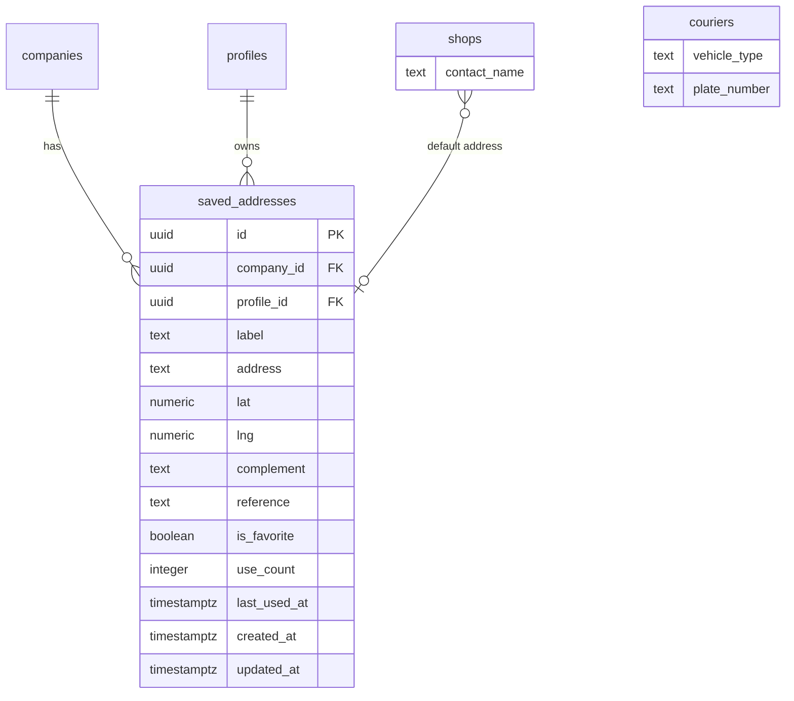

# Chega.la - Modelo de Dados Wave 5

Extensao do modelo entidade-relacionamento para a Wave 5: nova tabela de enderecos salvos e novos campos em tabelas existentes para completude de CRUD. Incremental sobre waves anteriores — tabelas existentes nao sao redefinidas aqui.

---

## Diagrama Entidade-Relacionamento (Wave 5 — novas entidades e relacoes)



---

## Nova Entidade

### saved_addresses

Enderecos salvos por lojista. Auto-salvos apos cada pedido, favoritaveis, com label personalizado.

| Campo | Tipo | Descricao |
|-------|------|-----------|
| id | uuid | PK, default gen_random_uuid() |
| company_id | uuid | FK para companies — multi-tenancy |
| profile_id | uuid | FK para profiles — dono do endereco |
| label | text | Nome amigavel (ex: "Filial Centro"). Nullable |
| address | text | Endereco formatado completo |
| lat | numeric(10,7) | Latitude |
| lng | numeric(10,7) | Longitude |
| complement | text | Complemento (apt, bloco). Nullable |
| reference | text | Ponto de referencia. Nullable |
| is_favorite | boolean | Se e favorito (default false) |
| use_count | integer | Quantidade de vezes usado em pedidos (default 0) |
| last_used_at | timestamptz | Data do ultimo uso. Nullable |
| created_at | timestamptz | Data de criacao (default now()) |
| updated_at | timestamptz | Data de atualizacao (default now()) |

---

## Alteracoes em Entidades Existentes

### couriers — novos campos

| Campo | Tipo | Descricao |
|-------|------|-----------|
| vehicle_type | text | Tipo de veiculo (moto, bicicleta, carro). Nullable |
| plate_number | text | Placa do veiculo. Nullable |

---

### shops — novos campos

| Campo | Tipo | Descricao |
|-------|------|-----------|
| contact_name | text | Nome do contato responsavel. Nullable |

---

## Enums (Wave 5)

Nenhum novo enum necessario. `vehicle_type` sera texto livre por enquanto (baixa cardinalidade, nao justifica enum dedicado).

---

## Indices Recomendados (Wave 5)

```sql
-- Enderecos salvos por perfil
CREATE INDEX idx_saved_addresses_profile ON saved_addresses(profile_id, is_favorite DESC, use_count DESC);

-- Enderecos salvos por empresa (multi-tenancy)
CREATE INDEX idx_saved_addresses_company ON saved_addresses(company_id);

-- Busca de enderecos por texto (label ou endereco)
CREATE INDEX idx_saved_addresses_label ON saved_addresses(profile_id, label) WHERE label IS NOT NULL;

-- Recentes por perfil
CREATE INDEX idx_saved_addresses_recent ON saved_addresses(profile_id, last_used_at DESC NULLS LAST);
```

---

## Triggers (Wave 5)

```sql
-- Atualizar updated_at na nova tabela
CREATE TRIGGER trg_saved_addresses_updated_at
  BEFORE UPDATE ON saved_addresses
  FOR EACH ROW EXECUTE FUNCTION update_updated_at();
```

---

## Migration SQL (Wave 5)

```sql
-- Nova tabela
CREATE TABLE saved_addresses (
  id uuid PRIMARY KEY DEFAULT gen_random_uuid() NOT NULL,
  company_id uuid NOT NULL,
  profile_id uuid NOT NULL,
  label text,
  address text NOT NULL,
  lat numeric(10, 7) NOT NULL,
  lng numeric(10, 7) NOT NULL,
  complement text,
  reference text,
  is_favorite boolean DEFAULT false NOT NULL,
  use_count integer DEFAULT 0 NOT NULL,
  last_used_at timestamp with time zone,
  created_at timestamp with time zone DEFAULT now() NOT NULL,
  updated_at timestamp with time zone DEFAULT now() NOT NULL
);

-- FKs
ALTER TABLE saved_addresses
  ADD CONSTRAINT saved_addresses_company_id_companies_id_fk
  FOREIGN KEY (company_id) REFERENCES companies(id) ON DELETE restrict;

ALTER TABLE saved_addresses
  ADD CONSTRAINT saved_addresses_profile_id_profiles_id_fk
  FOREIGN KEY (profile_id) REFERENCES profiles(id) ON DELETE cascade;

-- Novos campos em tabelas existentes
ALTER TABLE couriers ADD COLUMN vehicle_type text;
ALTER TABLE couriers ADD COLUMN plate_number text;

ALTER TABLE shops ADD COLUMN contact_name text;
```

---

## Relacionamentos Principais (Wave 5 — novos)

1. **Company → Saved Addresses**: 1:N — empresa tem multiplos enderecos salvos (multi-tenancy)
2. **Profile → Saved Addresses**: 1:N — cada lojista/operador tem seus enderecos salvos
3. **Courier → vehicle_type/plate_number**: novos campos descritivos, sem FK

---

## Nota sobre Escopo

Tabelas **fora do escopo** da Wave 5 (serao adicionadas em waves futuras):
- `dispatch_suggestions` — sugestoes de despacho inteligente
- `delivery_etas` — estimativas de tempo de entrega
- `tracking_links` — links publicos de rastreamento para cliente final
- `courier_documents` — documentos do motoboy (CNH, foto de veiculo)
- `courier_ratings` — avaliacoes do motoboy
