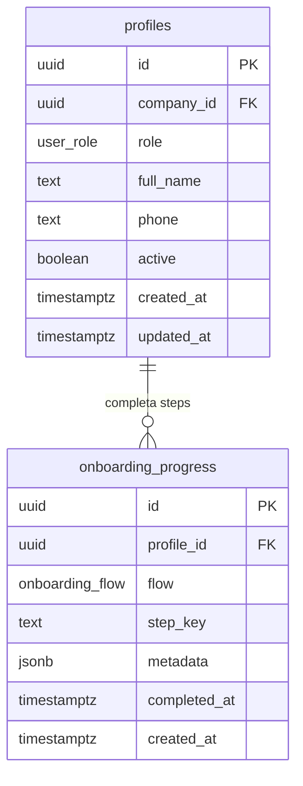

# Chega.la - Modelo de Dados Wave 6: Onboarding

Entidades adicionais para persistencia de progresso de onboarding por usuario.

---

## Diagrama Entidade-Relacionamento



---

## Entidades Detalhadas

### onboarding_progress

Registra cada step de onboarding completado por usuario. Uma linha por step completado — permite rastrear progresso parcial e reentrada.

| Campo | Tipo | Descricao |
|-------|------|-----------|
| id | uuid | PK, gen_random_uuid() |
| profile_id | uuid | FK para profiles.id — usuario que completou o step |
| flow | onboarding_flow | Enum do fluxo: wizard, tutorial, guided_overlay |
| step_key | text | Identificador unico do step dentro do fluxo (ex: "welcome", "company_data", "pricing") |
| metadata | jsonb | Dados extras do step (ex: campos preenchidos no wizard, GPS concedido no tutorial). Nullable |
| completed_at | timestamptz | Quando o step foi completado |
| created_at | timestamptz | DEFAULT now() |

---

## Enums

```sql
CREATE TYPE "public"."onboarding_flow" AS ENUM('wizard', 'tutorial', 'guided_overlay');
```

---

## Indices Recomendados

```sql
-- Progresso por usuario e fluxo (consulta principal)
CREATE INDEX "idx_onboarding_profile_flow" ON "onboarding_progress"("profile_id", "flow");

-- Unicidade: um step completado uma unica vez por usuario+fluxo
CREATE UNIQUE INDEX "idx_onboarding_unique_step" ON "onboarding_progress"("profile_id", "flow", "step_key");
```

---

## Relacionamentos Principais

1. **Profile → Onboarding Progress**: 1:N — um usuario pode ter multiplos steps completados em multiplos fluxos
2. **Onboarding Progress → Profile**: N:1 via profile_id FK

---

## Step Keys por Fluxo

### wizard (Central — operador)

| step_key | Descricao | Metadata esperada |
|----------|-----------|-------------------|
| welcome | Tela de boas-vindas visualizada | — |
| company_data | Dados da empresa preenchidos | `{ "company_name": string }` |
| pricing | Tabela de precos configurada | `{ "template_used": boolean }` |
| team_invite | Equipe convidada ou pulada | `{ "skipped": boolean, "invited_count": number }` |
| completed | Wizard finalizado | — |

### tutorial (Motoboy)

| step_key | Descricao | Metadata esperada |
|----------|-----------|-------------------|
| welcome | Tela de boas-vindas visualizada | — |
| gps_permission | Permissao GPS solicitada | `{ "granted": boolean }` |
| how_it_works | Tela "como funciona" visualizada | — |
| status_explained | Tela de status visualizada | — |
| completed | Tutorial finalizado | `{ "went_online": boolean }` |

### guided_overlay (Lojista)

| step_key | Descricao | Metadata esperada |
|----------|-----------|-------------------|
| delivery_address | Highlight endereco de entrega visualizado | — |
| recipient | Highlight destinatario visualizado | — |
| confirm_button | Highlight botao confirmar visualizado | — |
| post_order_flow | Modal de fluxo pos-pedido visualizado | — |
| completed | Overlay finalizado | — |

---

## Migration SQL

```sql
CREATE TYPE "public"."onboarding_flow" AS ENUM('wizard', 'tutorial', 'guided_overlay');

CREATE TABLE "onboarding_progress" (
    "id" uuid PRIMARY KEY DEFAULT gen_random_uuid() NOT NULL,
    "profile_id" uuid NOT NULL,
    "flow" "onboarding_flow" NOT NULL,
    "step_key" text NOT NULL,
    "metadata" jsonb,
    "completed_at" timestamp with time zone NOT NULL,
    "created_at" timestamp with time zone DEFAULT now() NOT NULL
);

ALTER TABLE "onboarding_progress" ADD CONSTRAINT "onboarding_progress_profile_id_profiles_id_fk"
    FOREIGN KEY ("profile_id") REFERENCES "public"."profiles"("id") ON DELETE cascade ON UPDATE no action;

CREATE INDEX "idx_onboarding_profile_flow" ON "onboarding_progress"("profile_id", "flow");
CREATE UNIQUE INDEX "idx_onboarding_unique_step" ON "onboarding_progress"("profile_id", "flow", "step_key");
```

---

## Rastreabilidade

| Entidade | Requisitos |
|----------|------------|
| onboarding_progress (wizard) | OSD001, OSD011, OSD012 |
| onboarding_progress (tutorial) | OSD020, OSD029, OSD030 |
| onboarding_progress (guided_overlay) | OSD040, OSD046, OSD047 |
